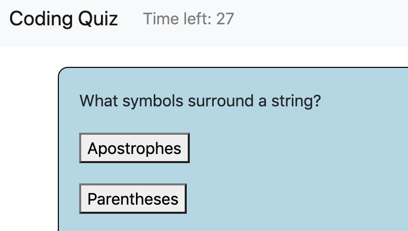

# Coding Quiz
> This website hosts a quiz where beginner coders can practice their Javascript knowledge. You are given 30 seconds for the quiz, gaining 10 seconds on the clock with every correct answer and losing 10 seconds with every incorrect answer. Different students can compete with one another on the same device, adding their scores to a leaderboard.

## Release History

* 0.0.1
    * Built in Vanilla Javascript 
* 0.1.1
    * Updated the code to JQuery standards
* 0.2
    * Added support for localStorage saving

## Meta
Repository [here](https://github.com/moonstripe11/hw4-codingQuiz).

Live Demo [here](https://moonstripe11.github.io/hw4-codingQuiz/).

Kojin Glick – [@kojinglick](https://twitter.com/kojinglick) – kojinglick@gmail.com
